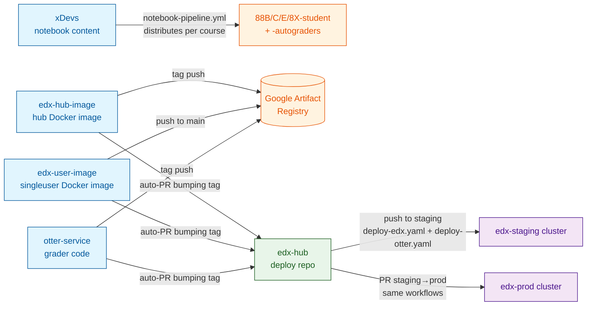
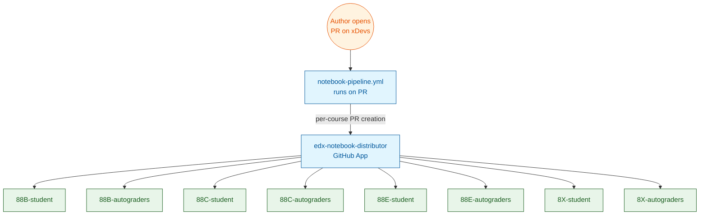
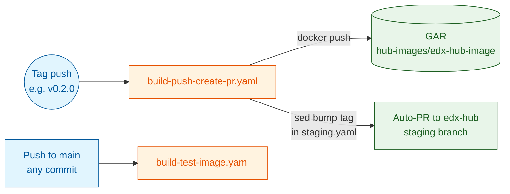
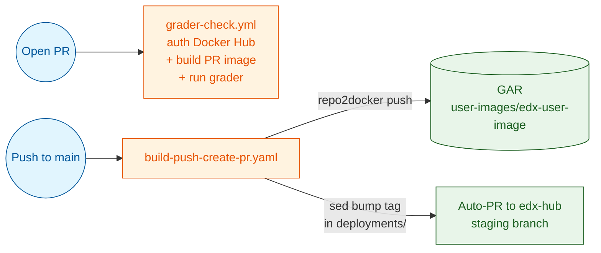
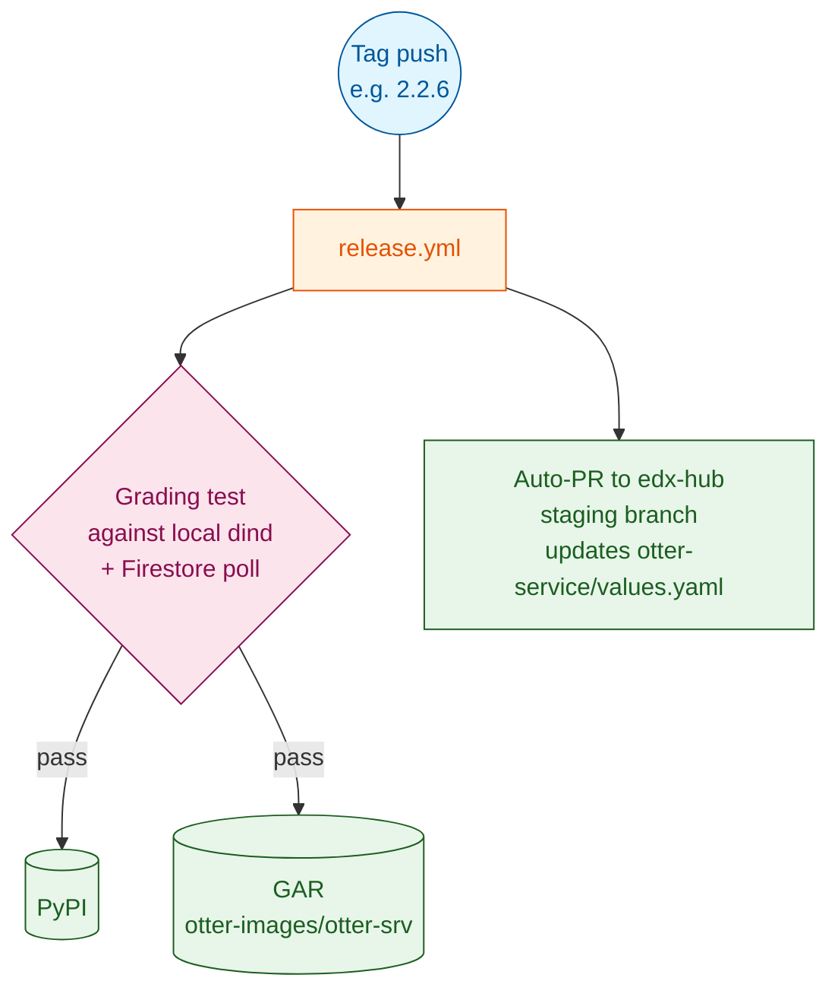
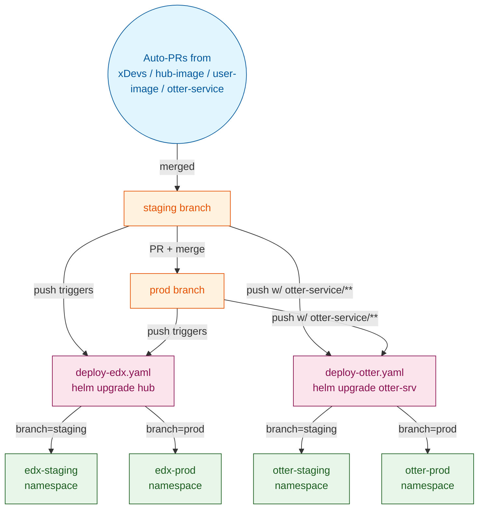

# edx-berkeley CI pipelines — visual overview

A guided tour of how code, content, and images flow from the source repos to the running cluster. Diagrams render natively on GitHub when you view this file.

If you're new: skim the **Big picture** first, then dive into the specific pipeline that's relevant to what you're doing.

---

## Big picture

Four parallel pipelines all eventually flow into **`edx-hub`** as the deploy point. From `edx-hub`, two clusters get updated: `edx-staging` (test) and `edx-prod` (production), each with their own hub + otter-service namespaces.

The rest of this doc zooms in on each of those four arrows.

---

## 1. xDevs notebook pipeline

`xDevs/` is the upstream authoring repo for ALL course content (88B, 88C, 88E, 8X). When a PR opens against `xDevs`, the **notebook-pipeline.yml** workflow distributes the changed notebooks to the matching `*-student` and `*-autograders` repos via the `edx-notebook-distributor` GitHub App.

**Key points:**
- `edx-notebook-distributor` must be installed on every contributor's fork of xDevs for the workflow to see private forks. Captured in `notebook_pipeline_app_install` memory.
- 88B/C-student + 88B/C-autograders have `delete_branch_on_merge=true` since 2026-05-16. Other repos may not.
- Direct `otter run` tests notebook content in xDevs itself before distribution — same `notebook-pipeline.yml`.

---

## 2. edx-hub-image — hub Docker image build & release

`edx-hub-image` is the Docker image that runs in the JupyterHub control-plane pod. On tag push (semver: `1.2.3`), it builds, pushes to GAR, and auto-PRs `edx-hub` bumping the hub-image tag in `deployments/edx/config/staging.yaml`.

**Important: `prod.yaml` is NOT auto-bumped.** Only `staging.yaml`. If staging→prod promotion is ever skipped or only includes config changes (not image bumps), `prod.yaml` can drift to an older tag than `staging.yaml`. This bit us 2026-06-11 — prod was on `0.1.0`, staging on `0.2.0`, and the LTI 1.3 work crashed prod's older multiauthenticator. See [[helm-lock-recovery]] for the recovery procedure + pre-promotion diff check.

---

## 3. edx-user-image — singleuser Docker image

`edx-user-image` is the Jupyter user-pod image (what students see). On push to `main`, it builds via `repo2docker-action`, pushes to GAR, and auto-PRs `edx-hub` bumping the singleuser image tag.

**Key points:**
- The `Docker Hub login` step in `grader-check.yml` exists to dodge Docker Hub's 100-pulls/6h anonymous rate limit (GH runners share NAT IPs). Authenticates with the Berkeley SPA `edxcdss` (`edx-ds@berkeley.edu`) per the [edx-service-account](https://github.com/sean-morris/claude-memory-edx-berkeley/blob/main/edx_service_account.md) memory note.
- The auto-PR opens against `staging` branch (per [`build-push-create-pr.yaml:143`](https://github.com/edx-berkeley/edx-user-image/blob/main/.github/workflows/build-push-create-pr.yaml#L143)). `prod.yaml` is NOT bumped — same drift concern as edx-hub-image.

---

## 4. otter-service — grader code release

`otter-service` is the Tornado grading service that receives submissions and posts grades back. On tag push (semver: `2.2.6`), it:
1. Builds + runs the full grading test against a local docker compose
2. Publishes to PyPI
3. Authenticates to GCP via Workload Identity Federation
4. Builds + pushes Docker image via `gcloud builds submit`
5. Auto-PRs `edx-hub` bumping `otter-service/values.yaml`'s tag

**Key points:**
- Tagging requires `__version__` bump in `src/otter_service/__init__.py` AND a `CHANGELOG.md` entry — see the release-checklist memory. Without the version bump, PyPI rejects the upload as a duplicate.
- Tag pushes go to **`upstream`** (`edx-berkeley/otter-service`), not `origin` (fork). Same memory note.
- The grading test takes ~15-25 min and uses Firestore round-trips — it can be the long pole when shipping fixes.

---

## How it all converges at edx-hub

`edx-hub` is where every other pipeline's auto-PR lands. The `deploy-edx.yaml` and `deploy-otter.yaml` workflows then deploy to the cluster, keyed off branch name.

**Important conventions:**
- The `STAGING_ENABLED` repo variable (Settings → Variables → Actions) gates whether staging actually redeploys on `staging` branch push. Set `false` when staging is intentionally torn down.
- Both workflows use SOPS-encrypted secrets via the GCP KMS key `data8x-sops/otter-service`. The `edx-hub-github-actions` service account has `cloudkms.cryptoKeyDecrypter` to read them at deploy time.
- Monitoring alerts (from `infra/monitoring/setup.sh`) watch all four namespaces for crashloops, uptime, NFS capacity, log-based patterns. First real fire: 2026-06-11 prod crashloop, caught within 6 min.

---

## Glossary

| Term | Meaning |
|---|---|
| GAR | Google Artifact Registry — Docker images for hub-image, user-image, otter-srv all live in `us-central1-docker.pkg.dev/data8x-scratch/*`. |
| KEDA | Kubernetes Event-Driven Autoscaling. Scales otter-srv pods from 0 → 1 on first request, back to 0 after 30 min idle. |
| LTI | Learning Tools Interoperability. Both 1.1 (legacy XML/OAuth1) and 1.3 (OAuth2 / OIDC / AGS) are live in prod — see migration plan memory. |
| Hub image vs user image | Hub image runs the JH control plane; user image is what students see in their pod. |
| SOPS | Mozilla SOPS — secrets in git, encrypted with GCP KMS. Deploy workflow decrypts at upgrade time. |
| Auto-PR | Workflow-generated PR (typically bumping a tag) — opened by a GitHub App on behalf of a workflow. |

---

## Where to learn more

- **In this repo (`.github`):** the README has the full secret/variable inventory and the high-level CI-process text.
- **Memory repo:** [claude-memory-edx-berkeley](https://github.com/sean-morris/claude-memory-edx-berkeley) — session-by-session decision log, durable gotchas, recovery procedures.
- **Per-repo `.claude/CLAUDE.md`:** when present, operational context for that repo specifically. `edx-hub/.claude/CLAUDE.md` is the deepest.